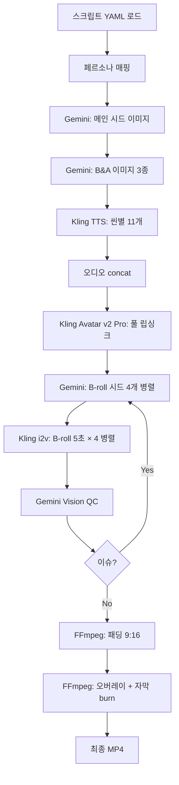

# 03. 파이프라인 기술 문서

## 🔧 기술 스택

| 용도 | 서비스 | 비고 |
|---|---|---|
| 이미지 생성 | Google Gemini 2.5 Flash Image (nano-banana) | 제품 라벨 유지 reference |
| 영상 립싱크 | fal.ai - Kling AI Avatar v2 Pro | 이미지+오디오 → 말하는 영상 |
| 영상 모션 B-roll | fal.ai - Kling 2.1 Pro image-to-video | 5초 동영상 |
| TTS | fal.ai - Kling TTS (영어) | 목소리 풀 45+ 개 |
| TTS (한국어) | fal.ai - ElevenLabs turbo-v2.5 | Korean 지원 |
| 편집 | FFmpeg + ASS 자막 | 합성/자막/오버레이 |
| 자동 QC | Google Gemini 2.5 Flash (Vision) | 할루시네이션 감지 |

> **참고**: Kling 직통 API (app.klingai.com) 는 계정 활성화 이슈로 사용 불가.
> fal.ai가 동일 모델 프록시 제공하며 안정적.

## 📂 프로젝트 구조

```
klinginter/
├── .env                          # API 키들 (git-ignore)
├── config/
│   ├── personas.yaml              # 페르소나 풀
│   ├── batch_20.yaml              # 20개 페르소나 원본
│   └── creative_scripts.yaml      # 29개 창의 스크립트 (v002~v030)
├── products/
│   └── melable_picoshot/
│       ├── product.png            # 제품 누끼
│       ├── usp.md                 # USP 파싱
│       ├── scripts/               # 개별 스크립트 JSON
│       ├── seeds/                 # 시드 이미지 (main + B-roll)
│       ├── scenes/                # B&A 이미지
│       ├── audio/                 # 씬별 TTS + concat full
│       ├── videos/                # Avatar mp4 + B-roll + padded
│       └── final/                 # 최종 mp4 + ASS 자막
└── src/
    ├── kling.py                    # Kling 직통 (현재 미사용)
    ├── fal_kling.py                # fal.ai 래퍼
    ├── gemini.py                   # Gemini 이미지 생성
    ├── persona.py                  # 페르소나 랜덤/매핑
    ├── subtitle.py                 # ASS 자막 생성
    ├── batch_20.py                 # 배치 처리
    ├── batch_mashup.py             # 릴레이 믹스업
    └── fix_subs_c.py               # 자막 재생성 (중년 한국어)
```

## 🔄 배치 파이프라인 단계



### 단계별 소요 시간

| 단계 | 시간 |
|---|---|
| Gemini 시드 1장 | 15~30s |
| Gemini B&A 2~3장 | 30~45s |
| Kling TTS 11개 직렬 | 40~60s |
| **Kling Avatar v2 Pro (40초 영상)** | **2~5분 ⭐** |
| Kling i2v B-roll × 4 (병렬) | 2~3분 |
| FFmpeg 합성 + 자막 burn | 20~30s |
| **합계** | **10~15분/편** |

## 🎙️ TTS Voice ID 목록 (검증됨)

### 영어 voice (Kling TTS via fal)
- `uk_man2` — 영국 성인 남성 (뉴스 톤)
- `uk_boy1` — 영국 젊은 남성 (활기찬)
- `uk_oldman3` — 영국 중년 남성 (차분)
- `oversea_male1` — 중립 남성 (글로벌)
- `chat1_female_new-3` — 여성 채팅 톤
- `girlfriend_1_speech02` — 여성 친구 톤
- `ai_shatang` — 아이 샤탕 (중국계 여성, 영어도 OK)
- `ai_kaiya` — 아이 카이야 (중국계 여성)
- `tianmeixuemei-v1` — 티안메이 (젊은 여성)
- `guanxiaofang-v2` — 관샤오팡 (여성)

### 한국어 voice (ElevenLabs)
- `Rachel` (기본) — 자연스러운 젊은 여성
- 그 외 Korean 지원 voice 다수

### ❌ 에러나는 voice
- `commercial_lady_en_f-v1` — "Voice id not found"
- `reader_en_m-v1` — "Voice id not found"

## 🔑 API 키 설정

`.env` 파일:
```bash
GEMINI_API_KEY=AIza...
FAL_KEY=xxx-xxx-xxx:xxx
KLING_ACCESS_KEY=xxx     # 현재 미사용 (1003 에러)
KLING_SECRET_KEY=xxx
```

## 📊 JWT 생성 방식 (Kling 직통용 - 참고)

```python
import jwt, time
def token(ak, sk):
    now = int(time.time())
    payload = {"iss": ak, "exp": now + 1800, "nbf": now - 5}
    return jwt.encode(payload, sk, algorithm="HS256")

# Authorization: Bearer <token>
```

## 🧪 자동 QC (Gemini Vision)

```python
from google.genai import types
def qc_frame(image_path):
    img = types.Part.from_bytes(
        data=open(image_path, "rb").read(),
        mime_type="image/jpeg")
    r = client.models.generate_content(
        model="gemini-2.5-flash",
        contents=[
            "Strict video QA. Check: (1) multiple people / mirror reflections, "
            "(2) cream near mouth, (3) Q-tip on face, (4) deformed limbs. "
            "Reply JSON: {\"issues\": [...]}",
            img])
    # parse and return issues list
```

할루시네이션 감지 시 해당 B-roll만 삭제 + 재생성 (1회 재시도).

## 🎨 Gemini 프롬프트 패턴

### 메인 시드 (talking head)
```
Photorealistic vertical 9:16 selfie. {persona_description}.
Holding this exact pink 'melable RubyRN PicoShot' jar (reference),
keep label identical. Front-facing portrait, mouth slightly open
about to speak, natural Instagram aesthetic, expressive face.
Exactly ONE person, no mirror reflections.
```

### B-roll 씬 (same identity)
```
Photorealistic 9:16 close-up of same ONE person as reference ({persona}).
{ROLE_TOP}: {motion_description}. Solid soft-lit interior background —
NO mirror, NO reflections, exactly ONE person in frame.
```

### Kling i2v negative prompt (공통)
```
multiple people, duplicate persons, mirror reflection, mirror, two people,
three people, crowd, extra arms, extra hands, deformed face, cream in
mouth, eating cream, licking product, jar near mouth, cotton swab,
applicator wand, Q-tip near face
```

## 🎞️ FFmpeg 합성 filter_complex (핵심)

```bash
# 1. 패딩 9:16 (1440×1440 → 1080×1920 + 상단/하단 검정바)
scale=1080:1080,pad=1080:1920:0:520:black,setsar=1

# 2. 오버레이 체인 (B-roll + B&A)
[0:v][broll1]overlay=0:520:enable='between(t,7.71,11.94)'[v1]
[v1][broll2]overlay=0:520:enable='between(t,16.23,21.65)'[v2]
...
[vN]ass='subs.ass'[v]   # ASS 자막 마지막에 burn (오버레이에 안 가림)

# 3. 최종 mux
-map [v] -map 0:a -c:v libx264 -crf 20 -c:a aac
```

## 🛠️ 재렌더 스크립트 (자막만 수정 시)

자막 개선 후 전체 영상 재생성 없이 **자막만 재burn** 가능:

```python
# fix_subs_c.py 참고
# padded 비디오 + B-roll 4개 + B&A 3장 + 새 ASS → 빠른 재렌더 (1~2분/편)
```

## 🚨 함정 및 해결 (상세는 06_실패_교훈.md 참고)

1. FFmpeg 필터 인덱스 하드코딩 → 동적 계산
2. Gemini 한국어 이미지 → 영어로 대체 + ASS 자막
3. 거울 셀피 페르소나 → 평면 배경으로 전환
4. Gemini 서브에이전트 랜덤 실패 (1%) → try/except + continue

## 📈 확장성

- **배치 10→100편**: 현재 YAML 방식으로 페르소나·훅 풀 확장만 하면 됨
- **신제품**: USP 엑셀만 교체, 스크립트 템플릿 재활용
- **다국어**: TTS 언어별 voice 선택, 자막 번역만 교체
